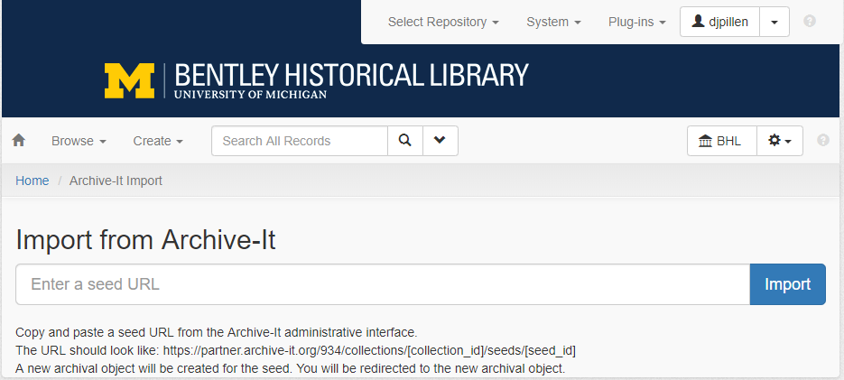

# BHL ArchivesSpace/Archive-It Integration
An ArchivesSpace plugin for importing Archive-It seeds. Imported seeds generate an archival object that is associated with a resource corresponding to the seed's Archive-It collection. A digital object instance with a File URI corresponding to that seed URL's Wayback Machine calendar page is also created and associated with the archival object. The archival object can then be associated with a parent component that represent's the website as a distinct intellectual entity separate from the website's URL at a given point in time. The plugin also adds support for exporting website-level archival objects as MARC XML. 

## Directory Structure
    backend\
        controllers\
            archive_it.rb
        job_runners\
            archive_it_collection_importer.rb
        model\
            lib\
                archive_it_export.rb
                archive_it_marc_model.rb
                archive_it_marc_serializer.rb
            archive_it.rb
        plugin_init.rb
    frontend\
        assets\
            add_archive_it_link.js
        controllers\
            archive_it_controller.rb
            archive_it_collection_map_controller.rb
        locales\
            en.yml
        models\
            archive_it.rb
        views\
            archive_it\
                index.html.erb
            archive_it_collection_map\
                index.html.erb
            archive_it_import_job\
                _form.html.erb
                _show.html.erb
            layout_head.html.erb
        plugin_init.rb
        routes.rb
    schemas\
        archive_it_import_job.rb
    config.yml

## Data Model
This plugin assumes a data model in which each Archive-It collection corresponds to an ArchivesSpace resource, each website corresponds to an archival object associated as a direct child-level component of a resource, and each Archive-It seed corresponds to an archival object associated as a direct child-level component of a website-level archival object. The site-level archival object contains descriptive metadata about the website (creator, subjects, abstract) and the seed-level objects contain capture dates and a digital object instance linking to the URL in the Wayback Machine.

    Resource
        Website 1
            Seed 1
              Digital Object Instance
            Seed 2
              Digital Object Instance
        Website 2
            Seed 3
              Digital Object Instance

## Usage
To enable this plugin, clone this repository to your ArchivesSpace installation's `plugins/` directory and add `bhl_aspace_archive_it` to `AppConfig[:plugins]` in your ArchivesSpace `config.rb`.

To import a new seed URL into ArchivesSpace, navigate to the repository settings menu (gear icon) in ArchivesSpace and select "Archive-It Import" from the "Plug-ins" drop down menu. You will be taken to the following screen in ArchivesSpace:

Copy and paste a seed URL from the Archive-It administrative interface (note: this is the URL of the Archive-It seed, not the URL of the website) and click the "Import" button. You will be redirected to a new archival object associated with the resource as configured in the above mapping. From there, you may drag and drop the archival object to associate the seed with existing site-level description or create new site-level description with which to associate the seed.

## How it Works
This plugin takes advantage of many of the [documented ArchivesSpace plugin mechanics](http://archivesspace.github.io/archivesspace/user/archivesspace-plug-ins/). Most of the functionality of this plugin is implemented in the `frontend` directory. The Archive-It import screen is implemented in `frontend/views/archive_it/index.html.erb`. The import functionality of this page is defined in an `ArchiveItController` class (`frontend/controllers/archive_it_controller.rb`) and an `ArchiveItImporter` class (`frontend/models/archive_it.rb`). The `ArchiveItController` takes the seed URL submitted on the Archive-It import screen and hands it off to the `ArchiveItImporter`, which uses the [Archive-It Partner Metadata API](https://support.archive-it.org/hc/en-us/articles/360032747311-Access-your-account-with-the-Archive-It-Partner-API) to get basic metadata about the seed (site URL, Archive-It collection ID) and then creates an ArchivesSpace archival object as described above. The `ArchiveItController` then redirects the user to the new archival object.

The plugin also implements several new [ArchivesSpace API endpoints](http://archivesspace.github.io/archivesspace/user/working-with-the-archivesspace-api/) in `backend/controllers/archive_it.rb`. These endpoints use `ArchiveIt` and `ArchiveItExport` classes defined in `backend/model/archive_it.rb` and `backend/model/lib/archive_it_export.rb`, respectively. These endpoints include:

### /repositories/:repo_id/archive_it/marc_candidates
This endpoint takes a repository id (`:repo_id`) and calls the `get_marc_candidates` function from the `ArchiveIt` class, which returns a list of all site-level archival objects.

### /repositories/:repo_id/archive_it/archive_it_collections
This endpoint takes a repository id (`:repo_id`) and calls the `get_archive_it_collection_map` from the `ArchiveIt` class, which returns the collection map configured in `AppConfig[:archive_it]` above.

### /repositories/:repo_id/archive_it/archive_it_marc/:id.xml
This endpoint takes a repository id (`:repo_id`) and archival object id (`:id`) and calls the `generate_archive_it_marc` function from the `ArchiveItExport` class, which returns a MARC XML representation of the archival object. The MARC XML mappings are configured in `backend/model/lib/archive_it_marc_model.rb` and `backend/model/lib/archive_it_marc_serializer.rb`.